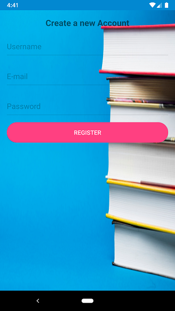
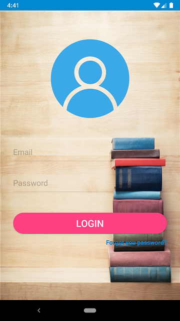

# BookMyBook

BookMyBook can be used to purchase **second hand** books. Specially when in college, purchasing new books in each semester is economically difficult for students. Thus **BookMyBook** can help in reducing the cost of books per semester.

## How does it works ? 

Register | Login
:--------|------:
| 

Upload a Book (User 1) | Home Screen
:-------------|-----------:
 | 

Initiate Request(User 2) | Accept Request (User 1)
:------------------------|-----------------------:
 | 